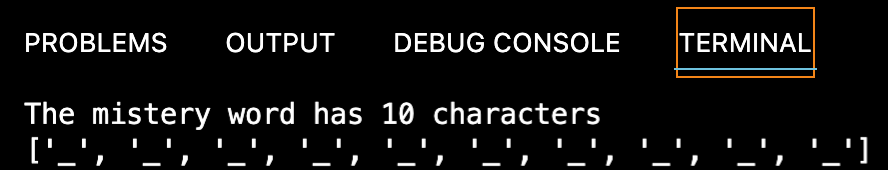
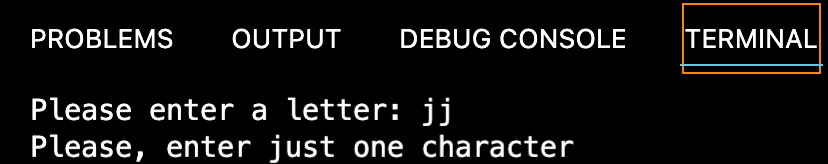
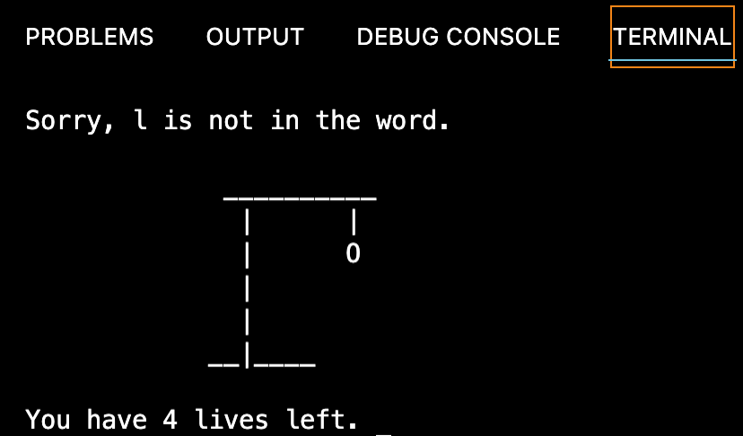
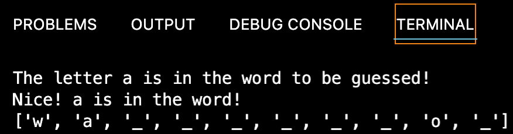
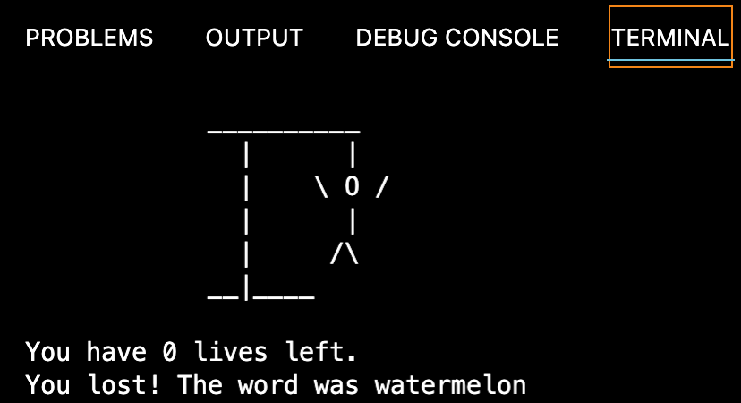
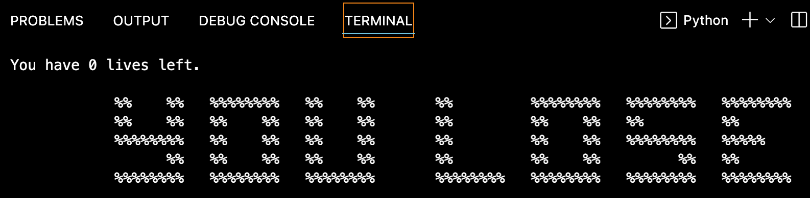

# Hangman (AiCore training)

[](https://www.python.org/)
[](https://github.com/Naereen/StrapDown.js/blob/master/LICENSE)
[](https://bitbucket.org/lbesson/ansi-colors)

> Hangman project that I developed as part of my AI and data engineering training at [AiCore](https://www.theaicore.com/). Hangman is a classic game in which a player thinks of a word and the other player tries to guess that word within a certain amount of attempts. This is an implementation of the Hangman game where the computer extracts a random word from a pre-determined list and the user tries to guess it.


The main aim of this project was to go over and practice basic Python syntax. It utilises OOP principles and is therefore built around one class,`Hangman`, which includes three methods: 
- `__init__(self, word_list, num_lives=5)`, which initialises the attributes as indicated in the docstring;
- `check_letter(self, letter) -> None`, which checks if the input letter provided by the user is in the random word;
- `ask_letter(self)`, which asks the user for a letter and checks if this letter has already been tried, and if the input is correct.

Being a command line application, the program can be executed using the `Python3 hangman_solution.py` command.

Upon initialisation, the user is informed of the length of the randomly selected word to be guessed, which is presented to them as an empty list along the lines of that in the following image.

<p align="center">

</p>

The user is then asked to guess a single letter and input it in the programme repeatedly, until they either win or lose the game. Messages are displayed throughout, as I discuss in what follows.

## Milestone 1

The basic logic of the Hangman game was provided in a publicly accessible [template](https://github.com/IvanYingX/Hangman_Test) by AiCore. Milestone 1 (M1) was straightforward, and is marked in the `hangman.solution.py` file as `# TODO 1`. M1 basically only required to modify the `ask_letter()` method to ask the user to input a letter, store it in a variable called `letter`, and check whether `letter` was just one character, or more.
  
```python
letter = input("Please enter a letter: ")
if len(letter) != 1:
    print("Please, enter just one character")
```

To test the code, the `ask_letter()` method could called within the `play_game()` function. In case of a wrong input of more than one character, the programme was instructed to print the following message:

<p align="center">

</p>

## Milestone 2

All required functionalities implemented in M2 are marked in `hangman_solution.py` as `# TODO 2`. M2 required the initialisation of the program's attributes as required in the docstring. These were as below:

```python
 def __init__(self, word_list, num_lives=5):
        self.word = random.choice(word_list)
        self.word_guessed = list('_' * len(self.word))
        self.num_letters = len(set(list(self.word)))
        self.num_lives = num_lives
        self.list_letters = []
        print(f"The mistery word has {self.num_letters} characters")
        print(f"{self.word_guessed}")
```
`word` is an attribute of the string type assigned to a word chosen randomly by the machine from `word_list`, a list that contains the following 6 elements: `['apple', 'banana', 'orange', 'pear', 'strawberry', 'watermelon']`. For this random selection to be possible, I imported the `random` package. `word_guessed` is a list attribute that contains as many `'_'` strings as there are characters in the randomly picked word; for this, I decided to use the `len()` string method. `num_letters` stores the number of *unique* letters in the word that have not been guessed yet as an integer. To do so, I first converted `word` into a list type using the `list()` method, and then used `len()` on the unique *unique* letters within it, which I singled out using the `set()` method. Finally, I initialised `num_lives`, the number of lives left, as an integer set later in the program as 5, and `list_letters` as a list to which all letters tried by the user are appended during the game. As required in the template, the programme runs `print(f"{letter} was already tried")` if the letter tried by the user is already in `list_letters`.

To check whether the `__init__` method worked, `__init__(word_list)` was called within the `play_game()` function, thus initialising the messages seen in the introduction, which I repeat below.

<p align="center">

</p>

As a bonus task, we were additionally invited to find a way to print diagrams that resembled the classic Handman drawings. My solution to the challenge was to create the following list of visuals, which I called `self.list_visual`.

```python
self.list_visual = [
            '''
            __________
              |      |
              |    \ O /
              |      |
              |     /\\
            __|____
            ''',''' 
            __________
              |      |
              |      O
              |      |
              |     /\\
            __|____
            ''','''
             __________
              |      |
              |      O
              |      |
              |     /
            __|____
            ''','''
             __________
              |      |
              |      O
              |      |
              |
            __|____
            ''','''
             __________
              |      |
              |      O
              |
              |
            __|____
            ''']
```
The diagrams in the list are in reverse order with respect to their appearence in the code, so as to be callable passing the number of lives (4 to 0) as the index of `self.list_visual`. For instance, once the user loses their first life, they're left with 4 lives. At that point, `print(f"{self.list_visual[self.num_lives]}")` prints the fifth element in `self.list_visual`, which is rendered as follows.

<p align="center">

</p>

## Milestone 3

In M3, all `# TODO 3` tasks had to be implemented, which were virtually all within the `check_letter()` method.

Given that the predetermined list of words to be guessed only contains lowercase letters, `check_letter()` first converts the input into lowercase characters using the `lower()` method. Subsequently, the method checks whether the input letter is in the random word to be guessed using an if-statement:

```python
letter = letter.lower()
        if letter in self.word:
            print(f"The letter {letter} is in the word to be guessed!")
```
If the letter is indeed in the word to be guessed, the respective `'_'` in the `word_guessed` list is replaced with the letter. Relevant messages are then printed accordingly, which I reproduce in the scrrenshot below.

```python
letter_index = 0
            for position, char in enumerate(self.word):
                if char == letter:
                    letter_index = position
                    self.word_guessed[letter_index] = letter
            print(f"Nice! {letter} is in the word!")
            print(f"{self.word_guessed}") 
```

<p align="center">

</p>

Conversely, when the input letter is not in the word to be guessed, the programme executes the else-statement below, which reduces the number of lives by 1, and prints messages accordingly: 

```python
else:
            self.num_lives -= 1
            print(f"Sorry, {letter} is not in the word.")
            print(f"{self.list_visual[self.num_lives]}")
            print(f"You have {self.num_lives} lives left.")
```

In all cases, the input letter is appended to the list of letters tried by the user, `list_letters`, using the `self.list_letters.append(letter)` command.

As for all previous methods, `check_letter()` can be tested by calling it within the `play_game()` function.

## Milestone 4

M4 implements all functionalities marked as `# TODO 4` in the template, which basically creates the logic behind the game by asking the user for a letter iteratively until the user either guesses the word or run out of lives. Messages are displayed accordingly, here I reproduce the message displayed when no lives are left.

<p align="center">

</p>

I decided to enclose this part of the code in a while-statement, as follows:

```python
while True:
        if game.num_lives == 0:
            print(f"You lost! The word was {game.word}")
            break
        elif game.num_letters > 0:
            game.ask_letter()
        else:
            print("Congratulations! You won!")
            break
```
For the sake of consistency, I did the same with the if-statement within the `check_letter()` method.

The coding of the logic behind Hangman basically marked the end of the project. Nevertheless, it was possible to improve one's code for extra bonus points, which I did. Therefore, the project directory, `hangman`, contains two .py files for this task: 
- `hangman_solution.py`, which I have been discussing so far;
- `hangman_solution_bonus.py`, a more polished version of `hangman_solution.py`, which dispenses with the instructions of the original file, adds comments to make the code clearer, and implements more catching messages created using a combination of ASCII characters. I discuss this in the following section.

### Improvements to the basic game

The code in `hangman_solution.py` was updated to make the code more lisible and the game clearer and more entertaining. The basic changes were as follows:
- The list of fruit was updated and now features 20 fruit names instead of just 6;
- all `# TODO` instructions were deleted;
- meaningful comments were added to make the code more straightforward;
- messages to be displayed during crucial moment of the game were added, which I decided to store in a new attribute of the `__init__` class, the `ascii_messages` list. This contains three messages, 'hello, 'you lose' and 'you win', which have the following forms:

```python
self.ascii_messages = [
            '''
            %%    %%   %%%%%%%%   %%         %%         %%%%%%%%   
            %%    %%   %%         %%         %%         %%    %%   
            %%%%%%%%   %%%%%      %%         %%         %%    %%   
            %%    %%   %%         %%         %%         %%    %%           
            %%    %%   %%%%%%%%   %%%%%%%%   %%%%%%%%   %%%%%%%%   
            ''','''
            %%    %%   %%%%%%%%   %%    %%       %%         %%%%%%%%   %%%%%%%%   %%%%%%%%
            %%    %%   %%    %%   %%    %%       %%         %%    %%   %%         %%
            %%%%%%%%   %%    %%   %%    %%       %%         %%    %%   %%%%%%%%   %%%%%
                  %%   %%    %%   %%    %%       %%         %%    %%         %%   %%
            %%%%%%%%   %%%%%%%%   %%%%%%%%       %%%%%%%%   %%%%%%%%   %%%%%%%%   %%%%%%%%
            ''','''
            %%    %%   %%%%%%%%   %%    %%       %%      %%   %%   %%     %%
            %%    %%   %%    %%   %%    %%       %%      %%   %%   %%%%   %%
            %%%%%%%%   %%    %%   %%    %%       %%  %%  %%   %%   %% %%  %%
                  %%   %%    %%   %%    %%       %%  %%  %%   %%   %%  %% %%
            %%%%%%%%   %%%%%%%%   %%%%%%%%        %%%%%%%     %%   %%   %%%%
            '''
        ]
```
When printed, the messages are rendered as shown in the image below:

<p align="center">

</p>