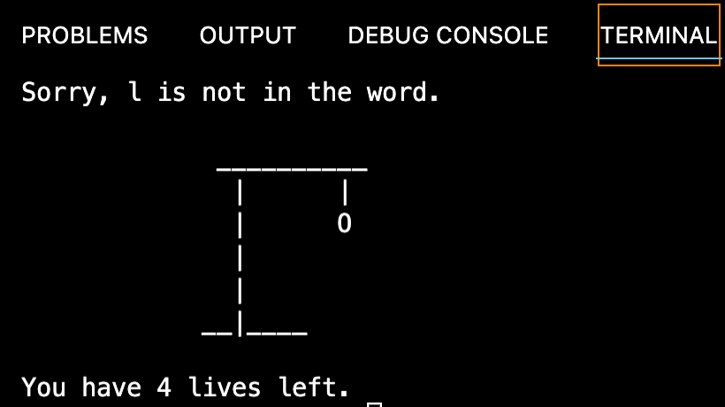

# Hangman (AiCore training)

[](https://www.python.org/)
[](https://github.com/Naereen/StrapDown.js/blob/master/LICENSE)
[](https://bitbucket.org/lbesson/ansi-colors)

> Hangman project that I developed as part of my AI and data engineering training at [AiCore](https://www.theaicore.com/). Hangman is a classic game in which a player thinks of a word and the other player tries to guess that word within a certain amount of attempts. This is an implementation of the Hangman game where the computer extracts a random word from a pre-determined list and the user tries to guess it.


The main aim of this project was to go over and practice basic Python syntax. It utilises OOP principles and is therefore built around one class,`Hangman`, which includes three methods: 
- `__init__(self, word_list, num_lives=5)`, which initialises the attributes as indicated in the docstring;
- `check_letter(self, letter) -> None`, which checks if the input letter provided by the user is in the random word;
- `ask_letter(self)`, which asks the user for a letter and checks if this letter has already been tried, and if the input is correct.

Being a command line application, the program can be executed using the `Python3 hangman_solution.py` command.

Upon initialisation, the user is informed of the length of the randomly selected word to be guessed, which is presented to them as an empty list along the lines of that in the following image.

<p align="center">

</p>

The user is then asked to guess a single letter and input it in the programme repeatedly, until they either win or lose the game. Messages are displayed throughout, as I discuss in what follows.

## Milestone 1

The basic logic of the Hangman game was provided in a publicly accessible [template](https://github.com/IvanYingX/Hangman_Test) by AiCore. Milestone 1 (M1) was straightforward, and is marked in the `hangman.solution.py` file as `# TODO 1`. M1 basically only required to modify the `ask_letter()` method to ask the user to input a letter, store it in a variable called `letter`, and check whether `letter` was just one character, or more.
  
```python
letter = input("Please enter a letter: ")
if len(letter) != 1:
    print("Please, enter just one character")
```

To test the code, the `ask_letter()` method could called within the `play_game` function. In case of a wrong input of more than one character, the programme was instructed to print the following message:

<p align="center">

</p>

## Milestone 2

All required functionalities implemented in M2 are marked in `hangman_solution.py` as `# TODO 2`.

As a bonus task, we were invited to find a way to print diagrams that resembled the classic Handman drawings. My solution to the challenge was to create the following list of visuals, which I called `self.list_visual`.

```python
self.list_visual = [
            '''
            __________
              |      |
              |    \ O /
              |      |
              |     /\\
            __|____
            ''',''' 
            __________
              |      |
              |      O
              |      |
              |     /\\
            __|____
            ''','''
             __________
              |      |
              |      O
              |      |
              |     /
            __|____
            ''','''
             __________
              |      |
              |      O
              |      |
              |
            __|____
            ''','''
             __________
              |      |
              |      O
              |
              |
            __|____
            ''']
```
The diagrams in the list are in reverse order with respect to their appearence in the code, so as to be callable passing the number of lives (4 to 0) as the index of `self.list_visual`. For instance, once the user loses their first life, they're left with 4 lives. At that point, `print(f"{self.list_visual[self.num_lives]}")` prints the fifth element in `self.list_visual`, which is rendered as follows.

<p align="center">

</p>

- The above command is used to check whether the topic has been created successfully, once confirmed the API script is edited to send data to the created kafka topic. The docker container has an attached volume which allows editing of files to persist on the container. The result of this is below:

```python
"""Insert your code here"""
```

> Insert screenshot of what you have built working.

## Milestone 3

- Continue this process for every milestone, making sure to display clear understanding of each task and the concepts behind them as well as understanding of the technologies used.

- Also don't forget to include code snippets and screenshots of the system you are building, it gives proof as well as it being an easy way to evidence your experience!

```python
"""Insert your code here"""
```

## Milestone 4

The project directory, `hangman`, therefore contains two solution .py files for this task: 
- `hangman_solution.py`, 
- `hangman_solution_bonus.py`, a more polished version of `hangman_solution.py`, which dispenses with the instructions of the original file, adds comments to make the code clearer, and uses more straightforward names for the attributes and methods.

### Improvements to the basic game

- The list of fruit was updated and now features 20 fruit name instead of just 6;

```python
while True:
            letter = input("Please enter a letter: ")
            if len(letter) != 1:
                print("Please, enter just one character")
                continue
            # prints message if the input letter has already been tried
            elif letter in self.list_letters:
                print(f"{letter} was already tried")
                continue
            # calls the check_letter method if the input letter is valid
            else:
                self.check_letter(letter)
                break
```

```python
self.ascii_messages = [
            '''
            %%    %%   %%%%%%%%   %%         %%         %%%%%%%%   
            %%    %%   %%         %%         %%         %%    %%   
            %%%%%%%%   %%%%%      %%         %%         %%    %%   
            %%    %%   %%         %%         %%         %%    %%           
            %%    %%   %%%%%%%%   %%%%%%%%   %%%%%%%%   %%%%%%%%   
            ''','''
            %%    %%   %%%%%%%%   %%    %%       %%         %%%%%%%%   %%%%%%%%   %%%%%%%%
            %%    %%   %%    %%   %%    %%       %%         %%    %%   %%         %%
            %%%%%%%%   %%    %%   %%    %%       %%         %%    %%   %%%%%%%%   %%%%%
                  %%   %%    %%   %%    %%       %%         %%    %%         %%   %%
            %%%%%%%%   %%%%%%%%   %%%%%%%%       %%%%%%%%   %%%%%%%%   %%%%%%%%   %%%%%%%%
            ''','''
            %%    %%   %%%%%%%%   %%    %%       %%      %%   %%   %%     %%
            %%    %%   %%    %%   %%    %%       %%      %%   %%   %%%%   %%
            %%%%%%%%   %%    %%   %%    %%       %%  %%  %%   %%   %% %%  %%
                  %%   %%    %%   %%    %%       %%  %%  %%   %%   %%  %% %%
            %%%%%%%%   %%%%%%%%   %%%%%%%%        %%%%%%%     %%   %%   %%%%
            '''
        ]
```